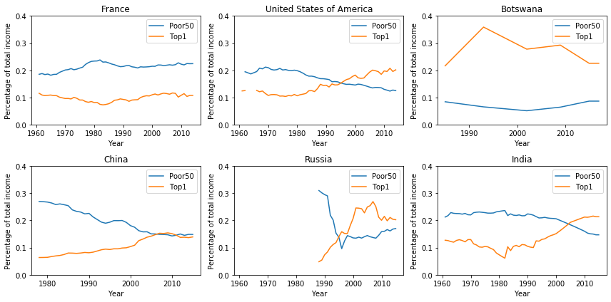
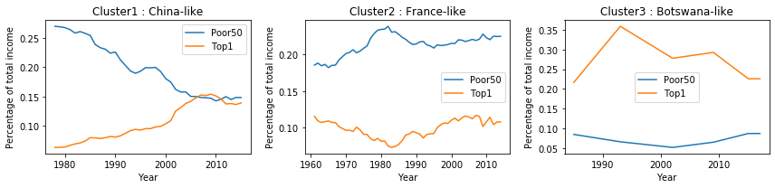

In this section, we study how income is distributed in different countries in the world.

Indeed, we have just found out how some countries are more responsible for the production in terms of crops and livestock. Production activities causes emission of CO2, which is one of the main causes of Climate Change. 

Of course, we cannot target production as *bad* a priori: it is actually a key element for the economy and overall wealth of a country. However, it could be important to examine how income and wealth is distributed within each country among its inhabitants, i.e. inspect how economic resources earned by productive activities are split.

The [**Matthew Effect**](https://en.wikipedia.org/wiki/Matthew_effect) is a quite common phenomenon that can be detected in many countries all over the world and which can be summarized in the sentence *the rich get richer and the poor get poorer*. Hereunder, you can see a visual example showing 6 different situations.

*The blue line in the plot showed above represents the percentage of total amount of income that is earned by the bottom 50% percent (the poorest) of the population of a given country, while the orange one shows the percentage earned by the Top 1% (the richest).*

These plots well explain the effect we were describing above, which is evolving faster and faster in recent years. While European countries (that have France as a representative country) managed to contain the phenomenon, developing countries like China or India are having great issues in controlling it. Interestingly, United States have a situation nearer to developing countries than to big economies like European ones: the gap between the rich and the poor part of the population is becoming more and more wide in recent years. Finally, Russian situation clearly describes what happened after the end of URRS.

## Clustering countries: which areas show similar patterns?

As we have seen, not all countries show similar patterns. Here we would like to group world countries in three separate clusters, and analyse how these clusters evolve in time. Clusters are defined by *representative* countries, which feature well separated income distribution patterns: China (developing countries), France (developed economies), and Botswana (under-developed or conflict areas).

Below, you can finally see how these clusters look like in three different periods of time. It can be easily spotted how today the European countries are clustered together, such as most of the developing countries like Brazil or India.

    <iframe id="graph" src="country_clustering.html" width="800" height="500"  frameborder="0"></iframe>

Our major interest is in the behaviour of those countries which are involved the most in CO2 emissions. From the map and the plots presented here, we can see how they generally suffer from Matthew Effect. This leads to consider these countries as top level not only in terms of agriculture and livestock prodcution, and CO2 emissions, but also in terms of income inequality.

*Note: cluster 0 is assigned to countries for which data are not available.*
