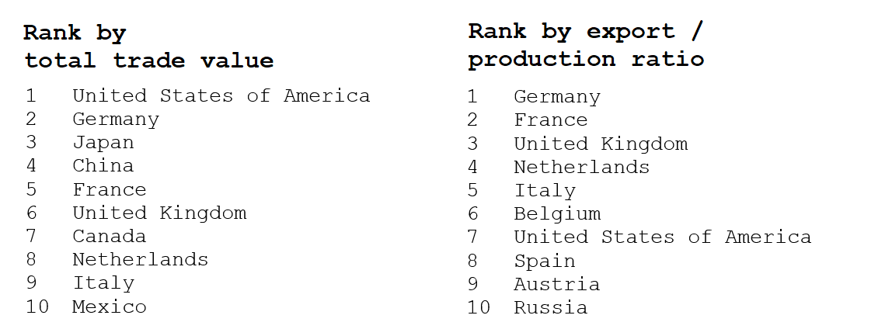

When looking at the emissions in agriculture, some countries perform noticeably worse than others. But are they responsible for the pollution they produce, or is this a commodity of the wealthiest countries that delocalize their production? Such countries usually hold up China, India or Brazil for their emissions, but are they free of guilt?

In order to provide further insights on such controversial theme, we dig into the FAO trade indices. Countries trading activities in agricultural products are evaluated both for absolute value of import/export and for values normalized on their total production. Countries that are main players in the agriculture trade economy will be on top of such ranking.

*All the data refers to the average in period 2000-2017*

The first of the two rankings below analyzes the centrality of world countries according to their trade absolute values. USA, Germany and Japan are the main players; however, such result is highly dependent on the size of the country and its production capacity. Therefore, countries centrality is also evaluated by considering the export/production ratio: in this second ranking, results drastically change, and top positions are occupied by European countries, which highly benefit from the European Single Market to increase their relevance. 

As we can see, among the most polluting countries, only China ad USA are present in top positions of these ranking: in particular, the absolute value of their trades is considerable, but becomes less relevant if we look at it with respect to the total production. Moreover, some of the most debated countries such as Brazil or India are out of both top-tens.

## A closer look at the trade network

At the bottom of the page, you can explore trading relations selecting the central country and looking at its main commercial partners in agriculture products both for import and export.

Looking at export networks for countries with higher emissions, usually only a minimal part of their production is exported to other countries. An an example, both China’s and India’s exports don’t even reach the 5 % of over their total production. In addition, these countries trade the largest volumes with closest countries: the first country China exports to is Japan.

Finally, most of these countries are tightly bonded with the United States, at least when large trade exchanges are involved. Analyzing where they import from, one can clearly spot how large part of the Mexican and Canadian agricultural production is consumed in the United States.

    <iframe id="graph" src="overall_export.html" width="1000" height="500" frameborder="0"></iframe>

    <iframe id="graph" src="overall_import.html" width="1000" height="500" frameborder="0"></iframe>

